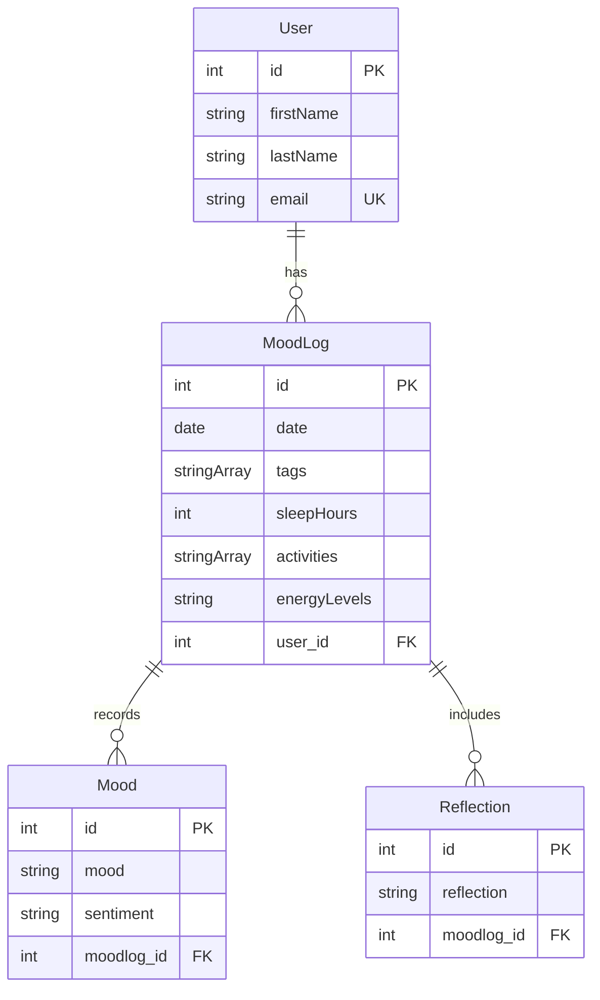

Just learning for now ...

Learning Roadmap: https://catnip-single-f71.notion.site/Mood-Tracker-App-Learning-Road-Map-31305a6c00f1800ea3baf797fd9b697f?source=copy_link

```mermaid
erDiagram
    User ||--o{ MoodLog : has
    MoodLog ||--o{ Mood : records
    MoodLog ||--o{ Reflection : includes
    User {
        int id PK
        string firstName
        string lastName
        string email UK
    }
    MoodLog { 
        int id PK 
        date date 
        stringArray tags
        int sleepHours
        stringArray activities
        string energyLevels
        int user_id FK 
    }
    Reflection { 
        int id PK 
        string reflection
        int moodlog_id FK
    }
    Mood { 
        int id PK 
        string mood
        string sentiment
        int moodlog_id FK
    }
```
